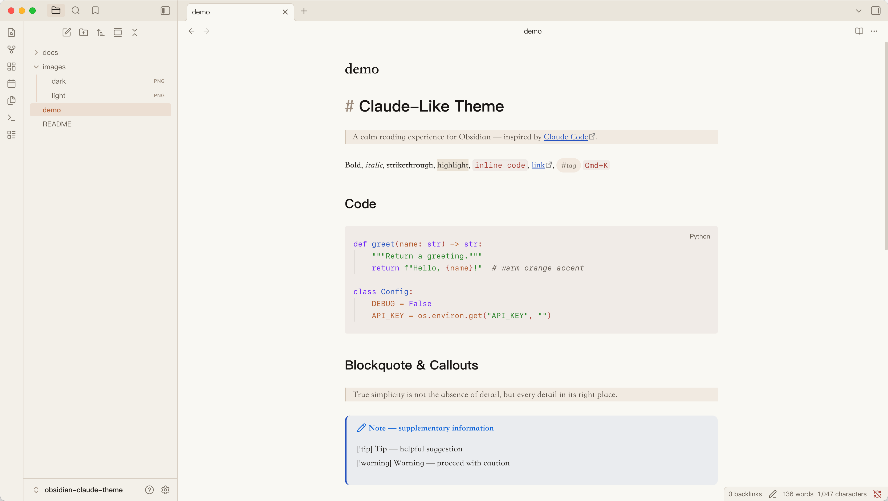
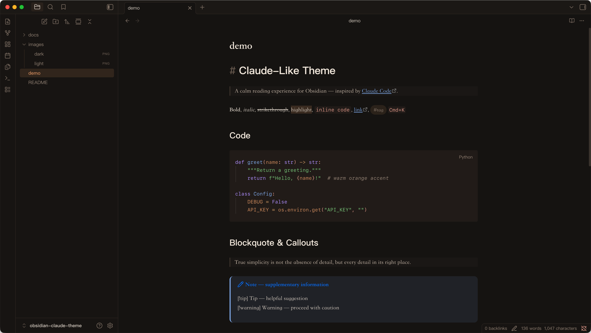

# Claude-Like

An Obsidian theme inspired by the visual aesthetic of [Claude Code](https://claude.ai/code) — warm off-white backgrounds, terracotta orange accents, and a calm reading experience that works equally well in light and dark mode.





---

## Inspiration

This theme draws from two sources:

- **[Claude Code](https://claude.ai/code)** — Anthropic's coding interface, with its warm `#faf9f5` off-white background, `#bc6a3a` burnt-orange accent, and low-saturation color palette designed for long reading sessions.
- **[Typora Claude-Like Theme](https://github.com/Muyiiiii/Typora_Claude-Like_Theme)** by [Muyiiiii](https://github.com/Muyiiiii) — a Typora theme that captures the same quiet, restrained atmosphere. The color tokens in this Obsidian theme are directly adapted from that work.

The goal isn't a pixel-perfect replica of Claude Code's UI, but to carry its reading atmosphere into Obsidian: warm neutrals, soft contrast, generous spacing, and syntax highlighting that doesn't fight for attention.

---

## Features

- **Light & dark mode** — independently tuned, not simply inverted
- **Warm color palette** — `#faf9f5` off-white / `#151210` near-black backgrounds, `#bc6a3a` / `#d59567` orange accents
- **Serif body font** — Songti SC / Noto Serif CJK SC for comfortable long-form reading
- **Syntax highlighting** — purple keywords, green strings, blue functions, italic comments
- **Pill-shaped inline code** — with warm tinted background
- **Styled callouts** — note / tip / warning / danger / quote, all tuned to the palette
- **Alternating table rows** — subtle warm tint
- **Tag pills** — rounded, accent-colored
- **Scrollbar** — slim, unobtrusive

---

## Installation

### Manual

1. Download `theme.css` and `manifest.json` from this repository
2. In Obsidian, go to **Settings → Appearance → Open themes folder**
3. Create a new folder named `Claude-Like`
4. Place both files inside it
5. Back in Obsidian, go to **Settings → Appearance → Themes** and select **Claude-Like**

### With an AI assistant (Claude Code / Cursor / etc.)

```
帮我下载这个 Obsidian 主题：https://github.com/<your-username>/obsidian-claude-theme
```

---

## Font Recommendations

The theme works with system fonts out of the box. For the best experience:

| Purpose | Recommended Font |
|---------|-----------------|
| Chinese body text | [Noto Serif CJK SC](https://fonts.google.com/noto/specimen/Noto+Serif+SC) |
| Monospace / code | [Cascadia Code](https://github.com/microsoft/cascadia-code) or [SF Mono](https://developer.apple.com/fonts/) |

---

## Acknowledgements

- [Muyiiiii](https://github.com/Muyiiiii) — for the original [Typora Claude-Like Theme](https://github.com/Muyiiiii/Typora_Claude-Like_Theme) that this work builds upon
- [Anthropic](https://anthropic.com) — for Claude Code's visual design language

---

## License

MIT
